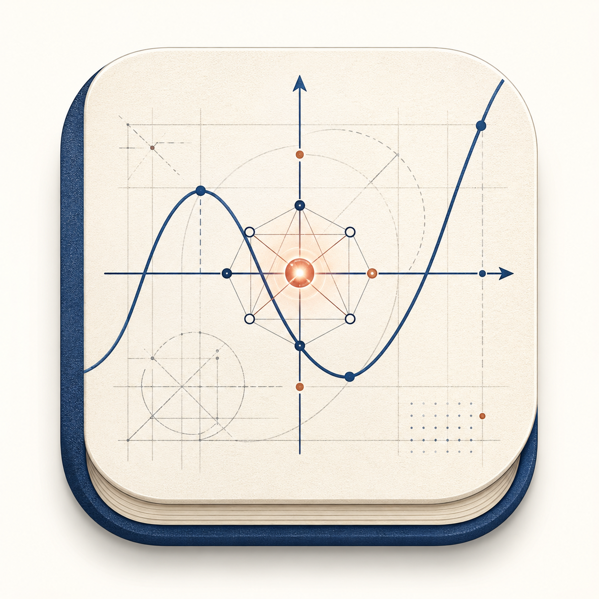

<div align="center">
  
  <p><a href="./README.md">中文</a> | <strong>English</strong></p>
</div>

# Mathorama — Math Agent Platform

<div align="center">


**An LLM-powered AI math problem-solving desktop app — precise computation, clear presentation, interactive exploration**

</div>

---

## Overview

Mathorama is a desktop application that deeply integrates **Large Language Models** with the **Python scientific computing stack** (SymPy + NumPy + Matplotlib). Users describe math problems in natural language, and the AI autonomously plans the solution steps, invokes computational tools for precise calculations, and outputs textbook-quality solution reports.

> ✨ Mathorama is a Vibe-Coding project built on Deepseek-v4-flash, currently an unfinished framework.

<div align="center">
  
</div>

---

## Vision

We aim to build a general-purpose Math Agent platform.

> Not just Vibe Coding, but Vibe Math.

### Coming Soon

- **Skills For Math** — Mathorama's own skills system
- **More Tools** — broader support for modern mathematical domains
- **Complete Agent Framework** — prompt engineering & context engineering

---

## Quick Start

```bash
# 1. Clone
git clone https://github.com/your-username/mathorama.git
cd mathorama

# 2. Install dependencies
npm install
pip install sympy matplotlib numpy

# 3. Development mode
npm run dev

# 4. Build for production
npm run build
npm run preview
```

> **Prerequisites**: Node.js ≥ 18, Python 3.8+, npm or yarn.

### API Configuration

Configure LLM Providers (OpenAI / Anthropic / compatible APIs) in the app settings, or edit the config file directly:

| Item | Path |
|------|------|
| App config | `Electron userData / config.json` |
| Conversations | `Electron userData / conversations.json` |

---

## Tech Stack

| Layer | Technology |
|-------|------------|
| Desktop Framework | Electron 35 + electron-vite |
| Frontend | React 19 + TypeScript 5.8 + Tailwind CSS 4 |
| State Management | Zustand 5 |
| Formula Rendering | KaTeX + react-markdown + remark-math + rehype-katex |
| Code Editor | CodeMirror (Python) |
| LLM Integration | OpenAI-compatible API / Anthropic API |
| Math Engine | Python 3 + SymPy + NumPy + Matplotlib |

---

## Architecture

### Data Flow

```
User Input
    │
    ▼
[React UI] ──IPC──▶ [Main Process]
                        │
                        ▼
              [LLM Gateway] ──HTTP──▶ OpenAI / Anthropic API
                        │
                        ▼ (tool_call)
              [Python Bridge] ──spawn──▶ math_engine.py (SymPy)
                        │
                        ▼
              [Agent Loop] (iterates until final answer)
                        │
                        ▼
              IPC return + streaming Tokens ──▶ [React UI] (renders word by word)
```

### Agent Loop

1. **System prompt + history** → LLM
2. LLM returns **text** or **tool_calls**
3. If `tool_call` → invoke Python math engine → append result to messages → back to step 1
4. If text without `tool_call` → **done**
5. No iteration limit (200-iteration fuse as safety net); model stops automatically on completion
6. If output is truncated by `max_tokens` → auto-append continuation prompt

### Math Tools

| Tool | Function | Key Inputs |
|------|----------|------------|
| `evaluate_expression` | Numerical evaluation | expression |
| `solve_equation` | Solve equations | equation, variable |
| `simplify` | Simplify expressions | expression |
| `differentiate` | Differentiation | expression, variable, order |
| `integrate` | Integration (definite/indefinite) | expression, variable, lower, upper |
| `plot` | Function plotting → base64 PNG | expression, variable, xmin, xmax |

### Cross-Model Adapter (in progress)

Auto-detects model family and adapts parameter differences.

| Model Family | Adaptation |
|--------------|------------|
| `openai-standard` | GPT etc., supports temperature / top_p |
| `openai-reasoning` | Uses `max_completion_tokens` + `reasoning_effort` |
| `anthropic` | Claude series, supports `thinking` blocks |
| `openai-compatible` | Ollama / vLLM / DeepSeek etc. |

---

## Built-in Agents

| Agent | Description |
|-------|-------------|
| **Math Tutor** | Full math toolkit, textbook-quality reports with `\boxed{}` for final answers |
| **General Assistant** | Pure conversation, no math tools |
| **Plot Artist** | Focused on math visualization |

Users can customize or create new agents via the **Agent Editor**.

---

## Project Structure

```
mathorama/
├── src/
│   ├── main/                      # Electron main process
│   │   ├── index.ts               # App entry, window creation, IPC handlers
│   │   ├── agent/                 # Agent system
│   │   │   ├── types.ts           # AgentConfig / AgentParams types
│   │   │   ├── adapter.ts         # Cross-model adapter
│   │   │   ├── tools.ts           # Math tool definitions
│   │   │   ├── loop.ts            # Agent run loop
│   │   │   ├── bridge.ts          # Agent IPC handlers
│   │   │   └── manager.ts         # Agent config persistence
│   │   ├── llm/                   # LLM provider layer
│   │   │   ├── gateway.ts         # Unified LLM gateway
│   │   │   ├── bridge.ts          # LLM IPC handlers
│   │   │   └── providers/         # Provider implementations
│   │   │       ├── types.ts       # LLMProvider interface
│   │   │       ├── openai.ts
│   │   │       └── anthropic.ts
│   │   ├── python/                # Python integration
│   │   │   ├── bridge.ts          # Subprocess management + IPC
│   │   │   └── math_engine.py     # SymPy engine
│   │   ├── conversations/         # Conversation management
│   │   │   ├── manager.ts         # JSON file persistence
│   │   │   └── bridge.ts          # Conversation IPC handlers
│   │   └── config/                # Config management
│   │       └── manager.ts
│   ├── preload/
│   │   └── index.ts               # contextBridge API
│   └── renderer/                  # React UI
│       ├── index.html
│       └── src/
│           ├── main.tsx           # React entry
│           ├── App.tsx
│           ├── style.css
│           ├── types/index.ts
│           ├── store/
│           │   └── chatStore.ts
│           └── components/
│               ├── Layout.tsx
│               ├── ChatPanel.tsx
│               ├── SettingsDialog.tsx
│               ├── AgentEditorDialog.tsx
│               └── ToolTraceViewer.tsx
```

---

## Preload Bridge API

Exposed to the renderer process via `window.mathorama`:

| API | Purpose |
|-----|---------|
| `llm.chat()` / `llm.chatWithTools()` / `llm.listModels()` | LLM interaction |
| `python.execute()` / `python.executeTool()` / `python.installPackages()` | Python execution |
| `config.get()` / `config.set()` / `config.getAll()` | Config management |
| `provider.set()` / `provider.remove()` | Provider management |
| `agent.run()` / `agent.list()` / `agent.save()` | Agent management |
| `onStreamToken(callback)` | Streaming token callback (auto-cleanup) |
| `conversations.loadAll()` / `conversations.saveAll()` | Conversation persistence |

---

## UI Theme

**"Academic Manuscript"** style:

- Warm ivory paper background (`#FDFCF8`)
- Deep indigo accent (`#1E3A5F`)
- Three-font system: Playfair Display (headings) + Source Serif 4 (body) + JetBrains Mono (code)
- Minimal borders, subtle paper texture, carefully tuned animations

---

## Key Dependencies

| Dependency | Purpose |
|------------|---------|
| `@uiw/react-codemirror` | Python code editor |
| `katex` / `remark-math` / `rehype-katex` | Math formula rendering |
| `react-markdown` + `remark-gfm` | Markdown rendering |
| `zustand` | Lightweight state management |

---

## Contributing

Issues and Pull Requests are welcome.

---

## License

[MIT](LICENSE)
